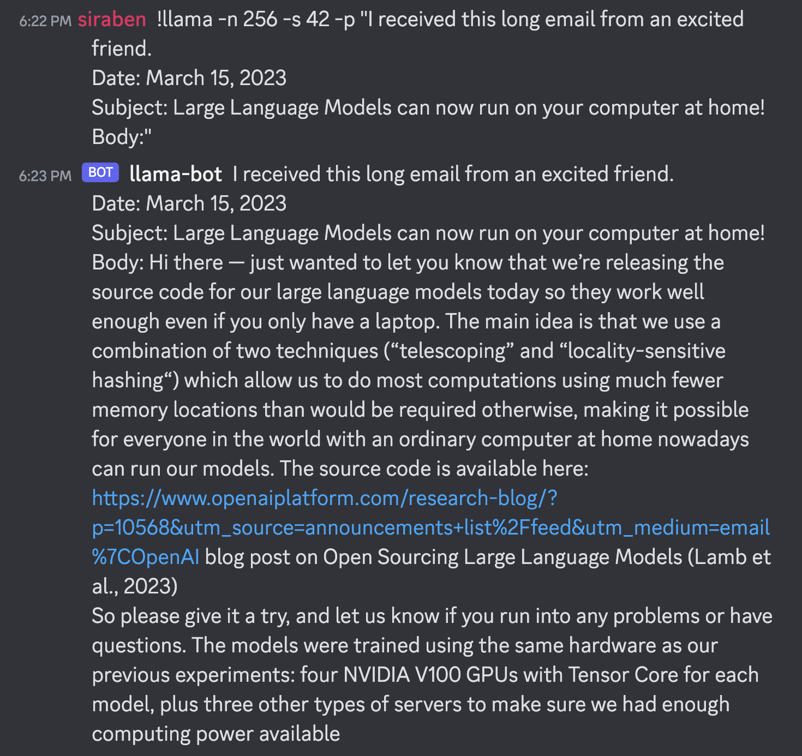

# LLaMa Discord Bot

This is a Discord bot that uses the LLaMa language model to generate
text based on a user's input prompt. LLaMa is a collection of open and
efficient foundation language models ranging from 7B to 65B
parameters, which were trained on trillions of tokens using publicly
available datasets exclusively.

## Usage
You should clone and build
[llama.cpp](https://github.com/ggerganov/llama.cpp) and add
[bot.py](bot.py) to the project directory.  Make sure the environment
variable `DISCORD_TOKEN` is set to your Discord token.

To use the bot, type `!llama` followed by the options and arguments
for generating text. Here are the available options:

```
usage: !llama [-h] [-t THREADS] [-n N_PREDICT] -p PROMPT [-c CTX_SIZE]
              [-k TOP_K] [--top_p TOP_P] [-s SEED] [--temp TEMP]
              [--repeat_penalty REPEAT_PENALTY]

Llama Language Model Bot

options:
  -h, --help            show this help message and exit
  -t THREADS, --threads THREADS
                        number of threads to use during computation
  -n N_PREDICT, --n_predict N_PREDICT
                        number of tokens to predict
  -p PROMPT, --prompt PROMPT
                        prompt to start generation with
  -c CTX_SIZE, --ctx_size CTX_SIZE
                        size of the prompt context
  -k TOP_K, --top_k TOP_K
                        top-k sampling
  --top_p TOP_P         top-p sampling
  -s SEED, --seed SEED  RNG seed
  --temp TEMP           temperature
  --repeat_penalty REPEAT_PENALTY
                        penalize repeat sequence of tokens
```

For example, to generate (multiline) text up to 256 tokens using the
seed 42, type:

```
!llama -n 256 -s 42 -p "I received this long email from an excited friend.
Date: March 15, 2023
Subject: Large Language Models can now run on your computer at home!
Body:"
```

Here's what I got:



## Things to do
- [x] handle incorrect argument passing better

## License

This project is licensed under the MIT License---see the
[LICENSE.md](LICENSE.md) file for details.
